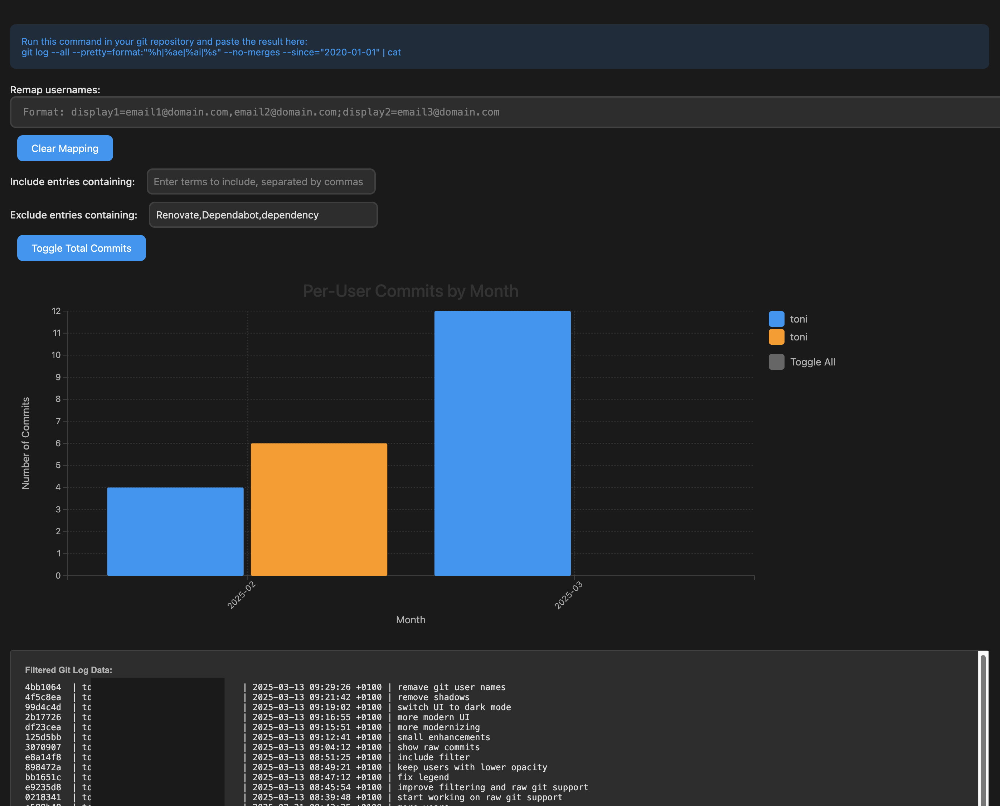

# Git Commit Visualizer

A modern, interactive web application for visualizing git commit history across users and time. View your repository's commit patterns with an elegant dark-mode interface.

🔗 [Try it live](https://raw.githack.com/xremix/GitCommitVisualizer/main/index.html)



## Features

### Data Input
- 📥 Drag & drop git log files
- 📋 Paste git log data directly
- 🔍 Supports standard git log format
- 💾 No server-side processing - all data stays in your browser

### Visualization
- 📊 Interactive bar chart visualization
- 📅 Monthly commit breakdown
- 👥 Per-user or total commits view
- 🎨 Modern dark mode interface
- 📱 Responsive design

### Filtering & Customization
- 🏷️ Include/exclude specific terms
- 👤 Username remapping (with local storage persistence)
- 🔄 Real-time updates
- 🎯 Interactive legend with toggle functionality

### Data Display
- 📑 Raw data view
- 💫 Smooth transitions and animations
- 🔍 Detailed tooltips
- 📊 Grid lines for better readability

## How to Use

1. Get your git log data by running:
```bash
git log --all --pretty=format:"%h|%ae|%ai|%s" --no-merges --since="2020-01-01" | cat
```

2. Input the data either by:
   - Dragging and dropping a file
   - Pasting directly into the text area

3. Customize the view:
   - Toggle between total and per-user views
   - Remap usernames (e.g., `display1=email1@domain.com,email2@domain.com`)
   - Filter commits using include/exclude terms
   - Click legend items to show/hide specific users

## Features in Detail

### Username Remapping
- Map multiple email addresses to a single display name
- Format: `displayName=email1,email2;displayName2=email3`
- Mappings automatically saved to local storage
- Clear mappings with one click

### Filtering System
- Include specific terms to show only matching commits
- Exclude terms to remove unwanted entries
- Case-insensitive matching
- Comma-separated terms for multiple filters

### Visualization Options
- Toggle between total commits and per-user breakdown
- Interactive bars with hover effects
- Color-coded user identification
- Monthly aggregation for better trend analysis

### Data Persistence
- Username mappings saved locally
- No server requirements
- Privacy-focused (all processing done client-side)

## Technical Details
- Built with vanilla JavaScript
- Uses D3.js for visualization
- Modern ES6+ features
- Local Storage API for data persistence
- Dark mode optimized

## Privacy Note
All processing is done client-side. No data is ever sent to any server or stored outside your browser's local storage (used only for username mappings).
